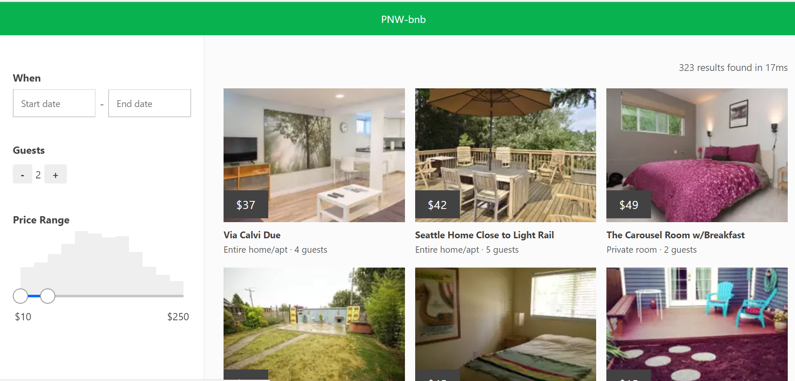

# PNW-bnb

#### An air-bnb clone built in React using [Reactivesearch](https://opensource.appbase.io/reactivesearch/)

[pic]: 

Reference-style: 
![alt text][logo]

[logo]: https://github.com/adam-p/markdown-here/raw/master/src/common/images/icon48.png "Logo Title Text 2"

------------------------------------------------

### **Key Concepts Employed**

1. Bootstrapping the creation of a React app with `create-react-app`.
1. Working with [Reactivesearch](https://opensource.appbase.io/reactivesearch/) components to create a site responsive to search parameters.